[](VIIT)
# Assignment1- Linux commands practice
## File related commands

   

1. ```ls ```
   
   Description
   

   Output
   
   

2. ```cd directory-path```
   
   Output
   


3. ```pwd```
   
   Description
   

   Output
   

   
4. ```mkdir``` 
    
     Description
   

   Output
   


5. ```rm```

    Description
   

   Output
   


6. ```cp``` 
    
     Description
   

   Output
   


7. ```mv```
   
    Description
   

   Output
   


8. ```touch```
    
     Description
   

   Output
   


9. ```cat```
    
     Description
   

   Output
   


10. ```nano```
    
   Description
   

   Output
   
   

11. ```ip ```

   Description
   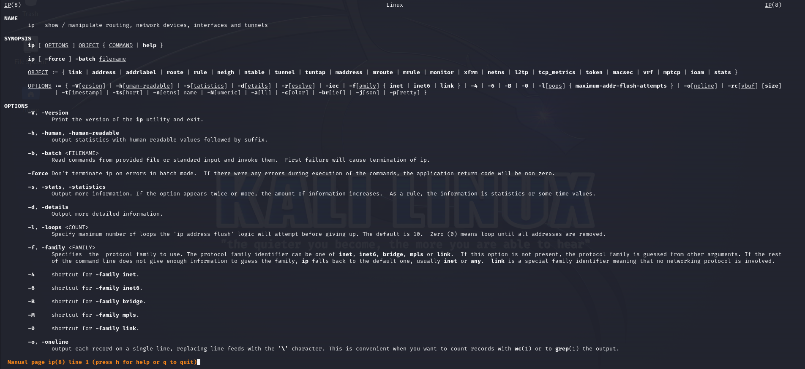
   
   Output
   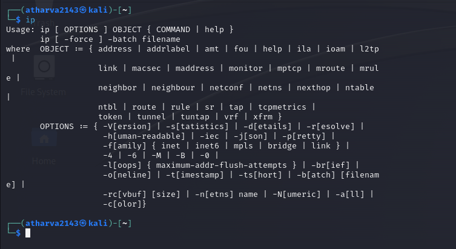
     

12. ```ip v ```

   Description
   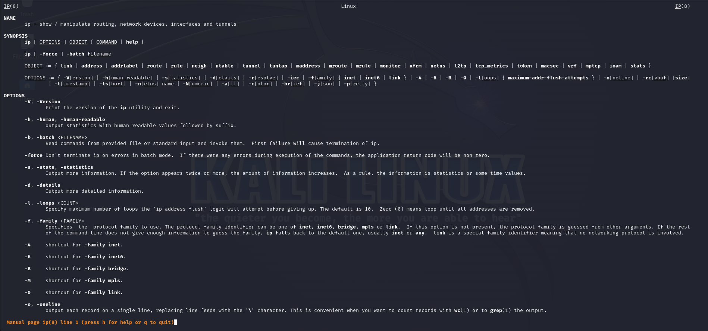 

   Output
   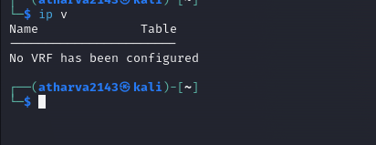
   


13. ```ip addr```

   Description
   

   Output
   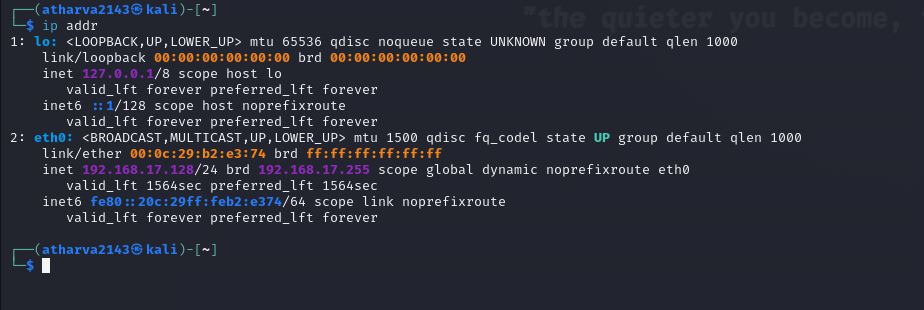
   


14. ```ip link```

   Description
   

   Output
   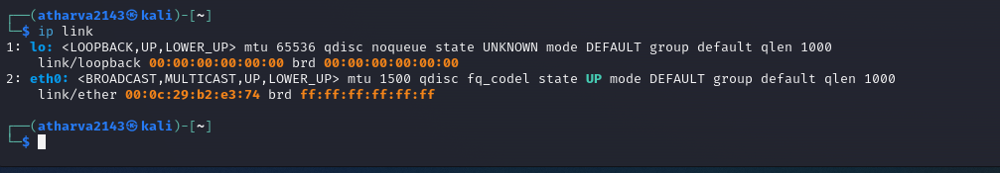
      

15. ```ip route```

   Description
   

   Output
   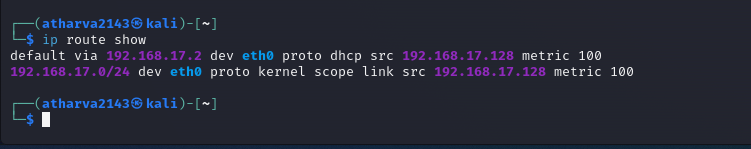
     
    

16. ```ifconfig```

   Description
   

   Output
   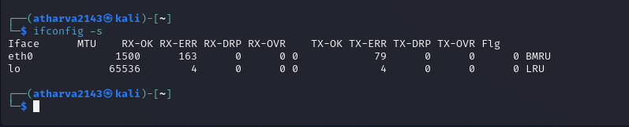
    

17. ```dig [website domain]```

   Description
   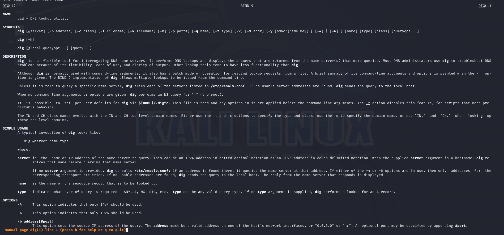
   
   Output
   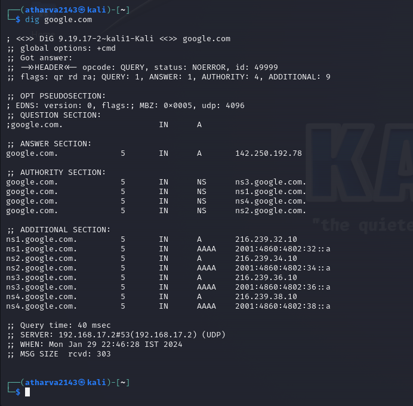
       


18. ```nslookup [website domain]```

   Description
   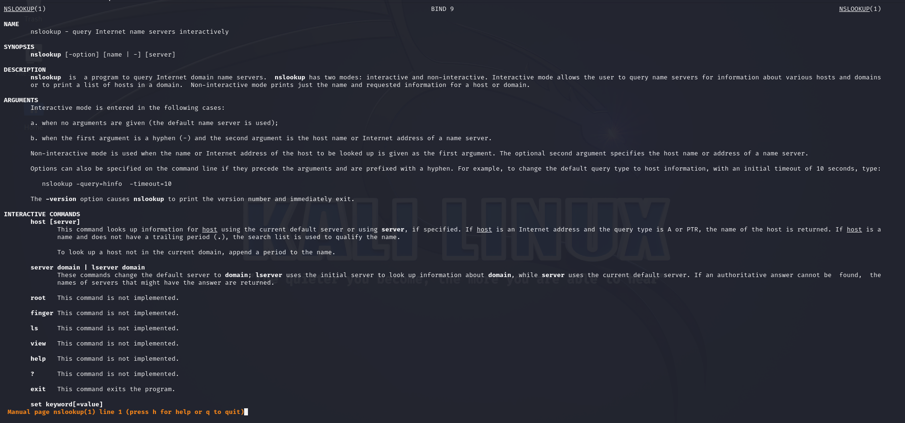 
   

   Output
   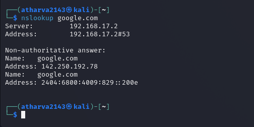
    

19. ```nslookup [website domain]```

   Description
   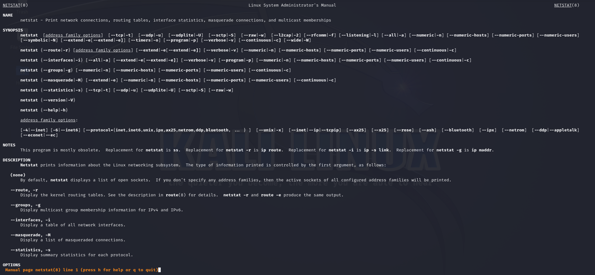

   Output
   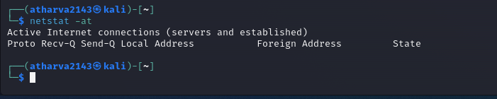     
