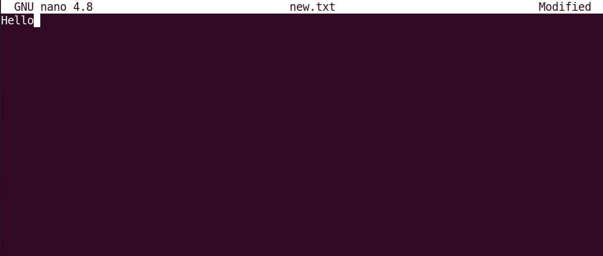

# Assignment1- Linux commands practice
## File related commands


1. ```ls ```
   
   Description
   

   Output
   
   
2. ```cd directory-path```
   
   Output
   
3. ```pwd```
   
   Description
   

   Output
   
   
4. ```mkdir``` 
    
     Description
   

   Output
   
5. ```rm```

    Description
   

   Output
   
6. ```cp``` 
    
     Description
   

   Output
   
7. ```mv```
   
    Description
   

   Output
   
8. ```touch```
    
     Description
   

   Output
   
9. ```cat```
    
     Description
   

   Output
   
10. ```nano```
    
     Description
   

   Output
   
   


    
